<div align="center">

# 🌱 Sajilo Kheti

### A land leasing and farming education platform for Nepal

Connecting idle landowners with aspiring farmers through verified listings, structured proposals, escrow-backed payments, real-time chat, and an agricultural knowledge hub.


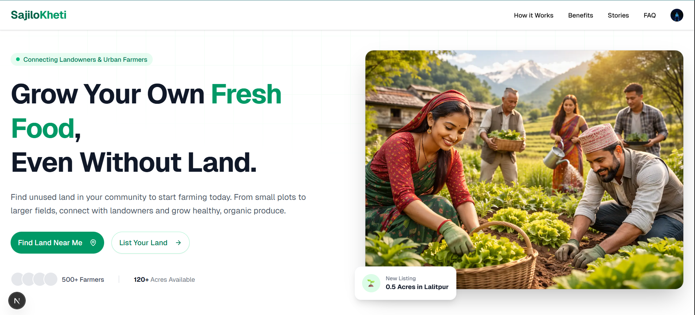

</div>

---

## Table of Contents

1. [Overview](#1-overview)
2. [Problem Statement & Objectives](#2-problem-statement--objectives)
3. [Key Features](#3-key-features)
4. [Screenshots](#4-screenshots)
5. [System Architecture](#5-system-architecture)
6. [Workflows & Design Diagrams](#6-workflows--design-diagrams)
7. [Tech Stack](#7-tech-stack)
8. [Project Structure](#8-project-structure)
9. [Routes & Access Control](#9-routes--access-control)
10. [Backend API Reference](#10-backend-api-reference)
11. [Escrow & Payment Lifecycle](#11-escrow--payment-lifecycle)
12. [Getting Started](#12-getting-started)
13. [Environment Variables](#13-environment-variables)
14. [Testing](#14-testing)
15. [Limitations & Future Enhancements](#15-limitations--future-enhancements)
16. [Team & Acknowledgements](#16-team--acknowledgements)

---

## 1. Overview

**Sajilo Kheti** ("easy farming" in Nepali) is a web platform that replaces word-of-mouth land leasing in Nepal with a transparent, structured digital marketplace.

In Nepal, land matters for agriculture, housing, small business and storage, yet a large share of usable land sits idle. Owners often live in cities or abroad and have no reliable way to reach serious tenants, while would-be farmers struggle to find listings they can trust. Existing platforms either stop at classified ads (HamroBazaar-style), focus on residential sales (property portals), or serve as official records without an interactive marketplace (government portals). Sajilo Kheti fills the gap between them:

| Criteria | P2P Classifieds | Property Portals | Government Portals | **Sajilo Kheti** |
|---|---|---|---|---|
| Primary goal | General P2P sales | Residential sales | Records & taxation | **Leasing & agri-education** |
| Trust factor | Low (unverified) | Medium (broker-led) | High (legal) | **High (KYC & escrow)** |
| Workflow | None (ads only) | Basic inquiry | Legal / manual | **Structured proposals** |
| Education | No | No | General info | **Integrated blog & modules** |
| Target user | General public | Real-estate buyers | Landowners | **Farmers & idle owners** |

The platform serves three roles, each with a dedicated dashboard:

| Role | What they can do |
|---|---|
| **Land Owner** | Complete KYC, list land with a map-based location picker, review lease proposals, chat with leasers, upload the signed Malpot agreement, receive escrow payouts |
| **Land Leaser** | Search and filter listings, submit proposals, pay into escrow via eSewa, chat with owners after acceptance, navigate to the land and the nearest Malpot office, read farming education content |
| **Admin** | Manage users, review landowner KYC and land certificates, approve or reject listings, verify Malpot papers and release or refund escrow, monitor transactions and analytics, send newsletters, moderate the blog |

> **About this repository.** This repo contains the **Next.js frontend** (UI, route handlers for eSewa / chat / blog / uploads, and the tRPC client). The business logic and database live in a separate **Express + tRPC + Prisma + MongoDB** backend. See [Getting Started](#12-getting-started) for how the two connect.

---

## 2. Problem Statement & Objectives

**Problem.** Perfectly usable land sits idle because it is hidden from the people who need it. Leasers face unreliable listings and difficulty reaching owners; existing platforms stop at the advertisement stage and leave users to handle contracts, communication and payment on their own.

**Objectives**

- Design and develop a web platform for transparent land leasing.
- Provide land listing and land management for verified owners.
- Provide secure access with separate user roles.
- Protect both sides of a lease with an escrow-style payment workflow.
- Promote productive land use through an integrated agricultural knowledge section.

**Scope.** Land listing creation and management, search and filtering, proposal submission with a negotiation workflow and notifications, role-based access control, KYC verification, a simulated escrow payment process, and administrative tooling for users, listings, reporting and record keeping.

---

## 3. Key Features

### Authentication & roles
- Sign-up, login, password reset and SSO callback powered by **Clerk**.
- Three roles (`LEASER`, `OWNER`, `ADMIN`) with route protection at the edge (`proxy.ts`) and a client-side `RoleGate` that redirects users to their own home.
- Users start as leasers and **upgrade to Owner via KYC** (citizenship document, selfie with in-browser face detection using `face-api.js`, and OCR assistance with `Tesseract.js`), reviewed manually by an admin.

### Land listing & discovery
- Owners publish land with images (up to 5 per upload), rent, area, location and lease conditions; admins approve or reject before it becomes public.
- Search and filter by region, rent range and land area.
- Interactive Google Maps view for each listing, with a **navigation page to the land and to the nearest Malpot Karyalaya** (Land Revenue Office).

### Proposals, chat & agreements
- Leasers submit structured proposals (intended use, duration, terms); owners accept or reject from a dedicated application review screen.
- **Real-time chat** (GetStream) is unlocked per lease only after a proposal is accepted.
- Browser **web-push notifications** (service worker + VAPID) for activity updates.

### Escrow-backed payments
- Accepted proposals move to an **eSewa** checkout. Funds are held in escrow until the signed **Malpot** agreement is uploaded and verified by an admin.
- On success the admin releases funds to the owner (after the platform commission); on cancellation the leaser is refunded and the land is re-listed as available.

### Community blog & learning
- Any registered user can write posts with a rich-text editor, choose a category, add tags, and receive upvotes and comments.
- Content is stored in **Sanity.io**; admins manage categories and moderate content through an embedded **Sanity Studio** at `/admin/studio`.

### Admin console
- Sidebar modules: **List Users, List Lands, List Leases, Review Landowner, Review Land Certificate, Transactions, Blogs, Reports, Analytics, Send mail**.
- Dashboard cards and charts (Recharts), **PostHog**-powered analytics, and newsletter broadcasts through **Resend**.

### Engineering quality
- End-to-end type safety from database to UI (Prisma → tRPC → React), with **Zod** validation.
- Unit/component tests with **Vitest + React Testing Library** and browser tests with **Playwright**.
- Responsive UI built with **Tailwind CSS v4**, **shadcn/ui** and **Radix** primitives.

---

## 4. Screenshots

### Landing page
<p align="center">
  <br>
  <em>Public landing page with calls to action for leasers and landowners.</em>
</p>

### Listing land (Owner)
<p align="center">
  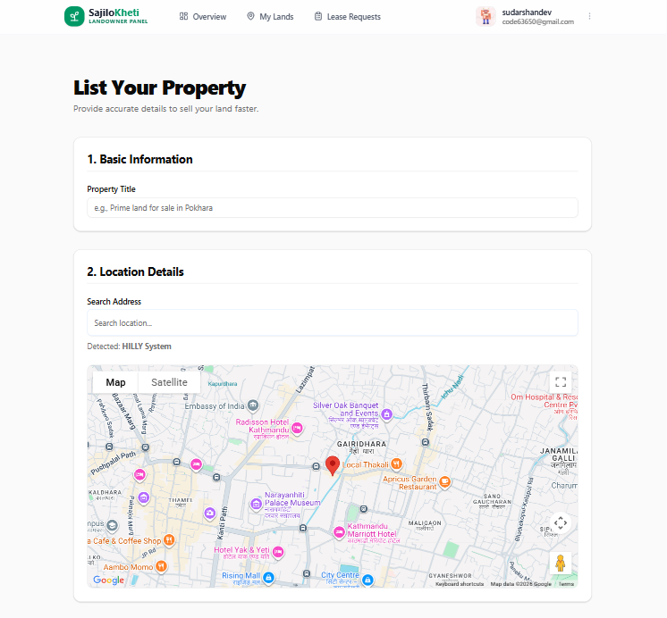<br>
  <em>Owners publish land with details, pricing and a map-based location.</em>
</p>

### Search & filter (Leaser)
<p align="center">
  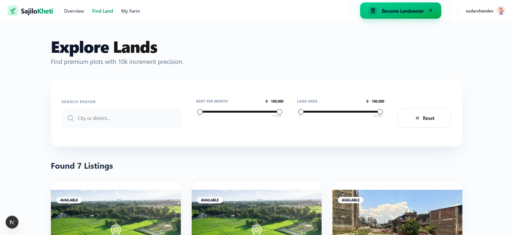<br>
  <em>Browse available land and narrow it down with filters.</em>
</p>

### Application review (Owner)
<p align="center">
  <br>
  <em>Owners review proposals from leasers and accept or reject them.</em>
</p>

### Payment via eSewa and escrow status
<p align="center">
  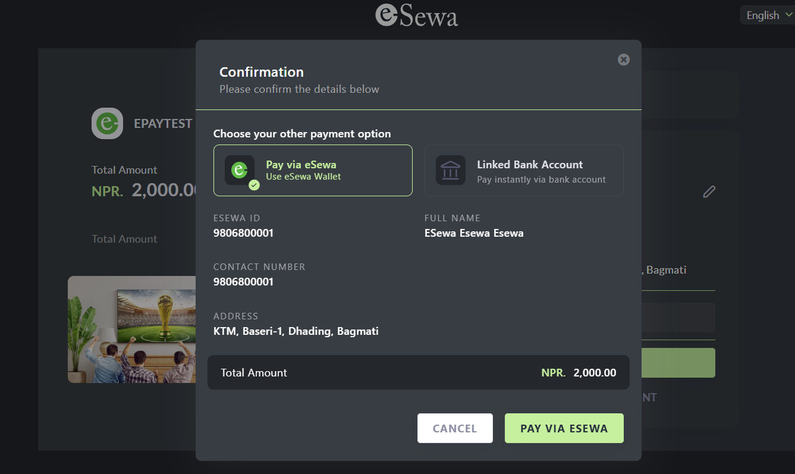<br>
  <em>eSewa checkout for the escrow deposit.</em>
</p>
<p align="center">
  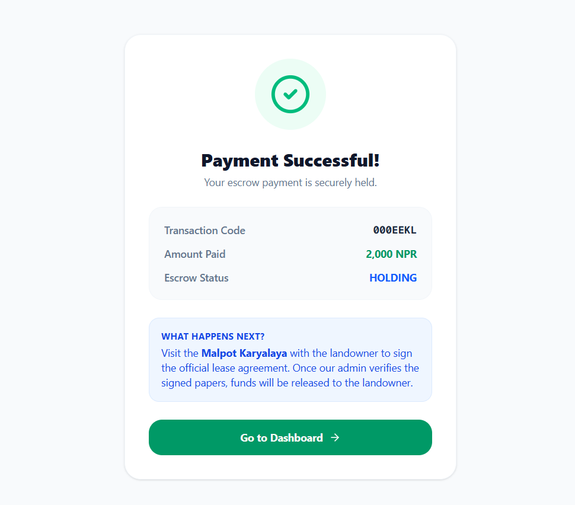<br>
  <em>Escrow summary for an accepted application.</em>
</p>
<p align="center">
  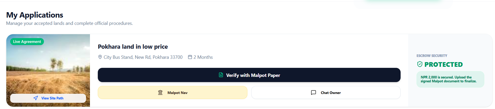<br>
  <em>After payment the lease is a "Live Agreement" with the escrow marked <strong>Protected</strong>, plus shortcuts to Malpot navigation and chat.</em>
</p>

### Malpot document verification
<p align="center">
  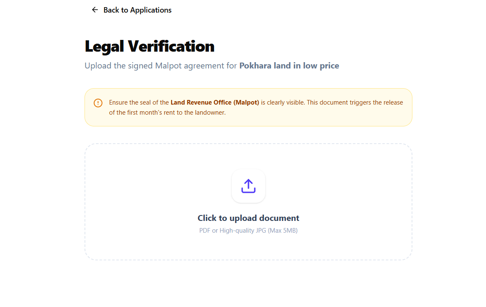<br>
  <em>The signed Malpot agreement (official seal visible) is uploaded; once an admin verifies it, escrow is released and the lease is finalized.</em>
</p>

### Real-time chat
<p align="center">
  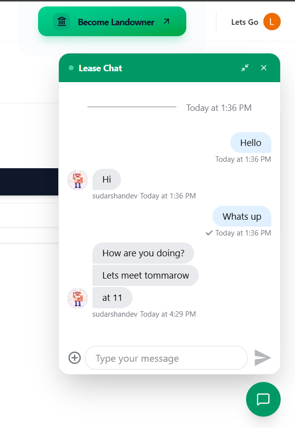<br>
  <em>Owner–leaser messaging, available once a proposal is accepted.</em>
</p>

### Navigation to the land and the nearest Malpot office
<p align="center">
  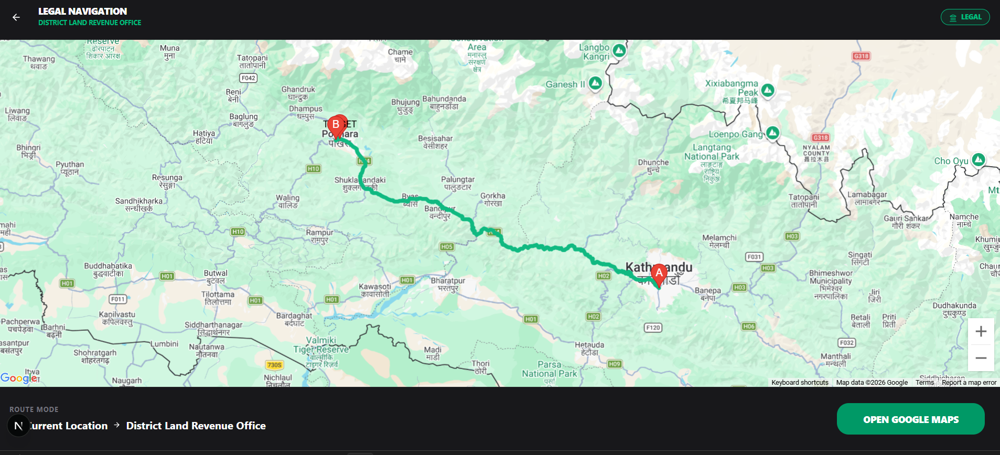<br>
  <em>Each listing stores coordinates, so users can get directions to the land and to the nearest Land Revenue Office.</em>
</p>

### Community blog
<p align="center">
  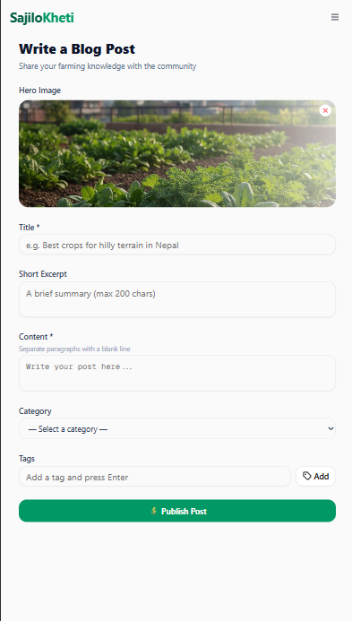<br>
  <em>Rich-text blog creation with category and tags.</em>
</p>
<p align="center">
  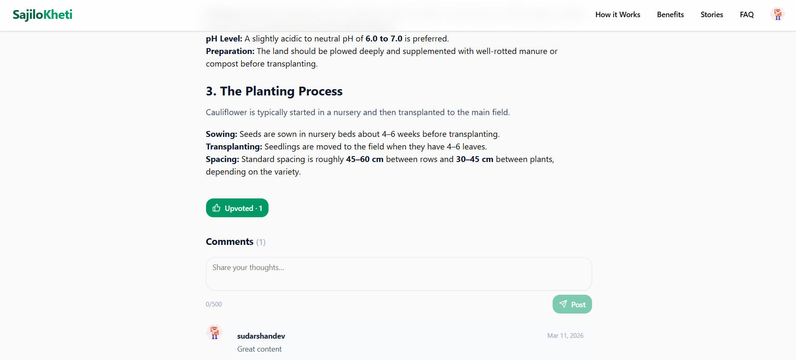<br>
  <em>Readers engage through upvotes and comments.</em>
</p>

### Admin panel
<p align="center">
  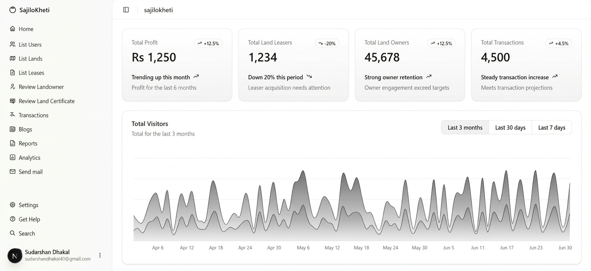<br>
  <em>Admin dashboard with summary cards, visitor chart and the management sidebar.</em>
</p>

---

## 5. System Architecture

<p align="center">
  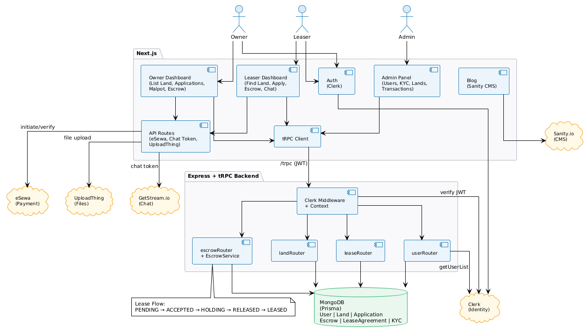<br>
  <em>Frontend, backend and external services of the Sajilo Kheti platform.</em>
</p>

The system is organised in three layers.

**Frontend (this repo).** A Next.js App Router application with role-specific dashboards for Leaser, Owner and Admin. All data access goes through a centralized **tRPC client** (TanStack Query) that sends authenticated requests with Clerk-issued JWTs. A few server-side Next.js route handlers cover things that must hold secrets: eSewa signature generation/verification, GetStream token minting, Sanity writes and UploadThing.

**Backend (separate repo, `express-trpc`).** An Express server exposing tRPC. A Clerk middleware verifies the JWT and builds a typed context with the user's identity and role. Requests are dispatched to four domain routers, each enforcing role-based access control:

- `userRouter`: profiles, role upgrades, KYC
- `landRouter`: listings, search, moderation
- `leaseRouter`: applications and lease lifecycle
- `escrowRouter`: escrow state, delegating payment logic to an `EscrowService`

Data is persisted in **MongoDB** through **Prisma**, with core models for User, Land, Application, Escrow, LeaseAgreement and KYC details.

**External services**

| Service | Role |
|---|---|
| Clerk | Authentication, sessions, identity |
| eSewa | Payment initiation and verification |
| GetStream.io | Real-time chat channels per lease |
| UploadThing | Land images, citizenship documents, selfies, Malpot papers |
| Sanity.io | Headless CMS for the blog |
| Google Maps | Map display, directions, nearest Malpot office |
| Resend | Newsletter subscriptions and broadcasts |
| PostHog | Product analytics |

---

## 6. Workflows & Design Diagrams

### 6.1 Sequence diagram

<p align="center">
  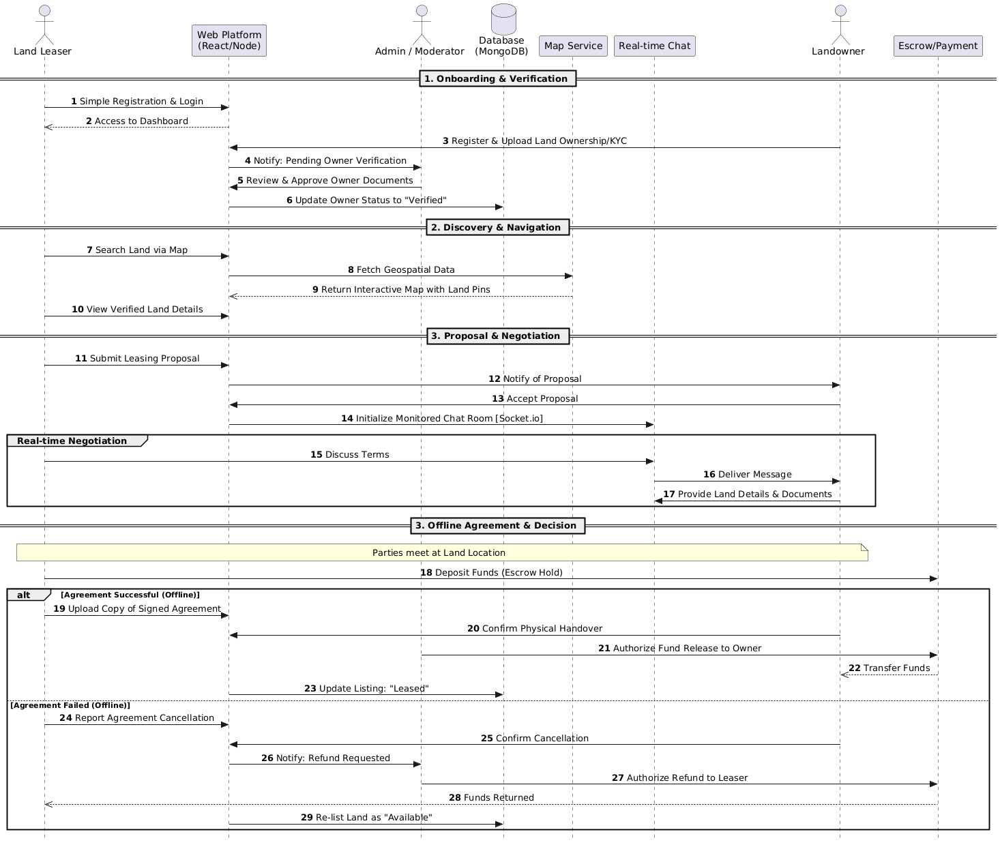<br>
  <em>Lifecycle of a lease from registration to settlement or cancellation.</em>
</p>

The lifecycle has four phases:

1. **Onboarding & verification.** Landowners upload KYC and land ownership documents; an admin reviews them before the owner is marked *Verified*.
2. **Discovery & negotiation.** Leasers explore listings on the map and submit a proposal. When the owner accepts, a chat channel is created so both parties can agree on terms and arrange a site visit.
3. **Offline agreement & financial security.** In line with local legal practice, the lease is signed offline at the land location. Meanwhile the leaser deposits the lease amount into escrow as a sign of commitment.
4. **Finalization or exception handling.**
   - *Agreement successful:* the leaser uploads the signed agreement, the owner confirms handover, the admin releases funds to the owner, the listing becomes **Leased**, and the leaser gains access to the farming education modules.
   - *Agreement failed:* the admin refunds the escrow to the leaser and the land returns to **Available**.

### 6.2 Overall flow

<p align="center">
  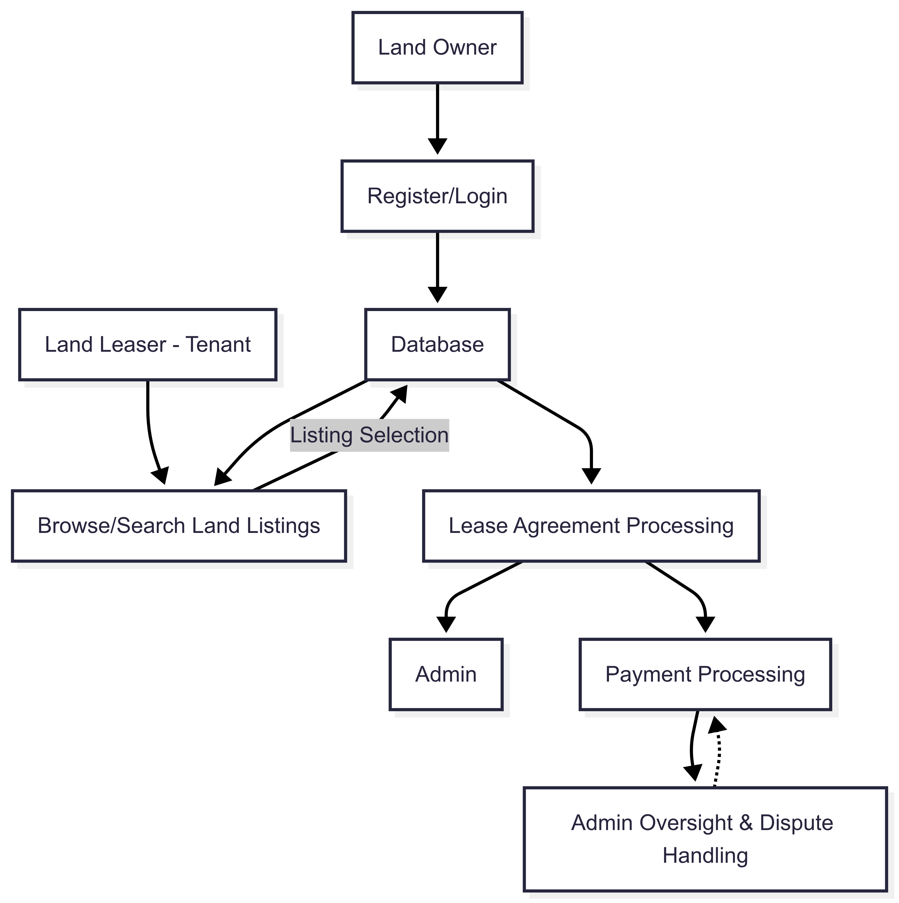<br>
  <em>Overall flow of the platform.</em>
</p>

### 6.3 Use case diagram

<p align="center">
  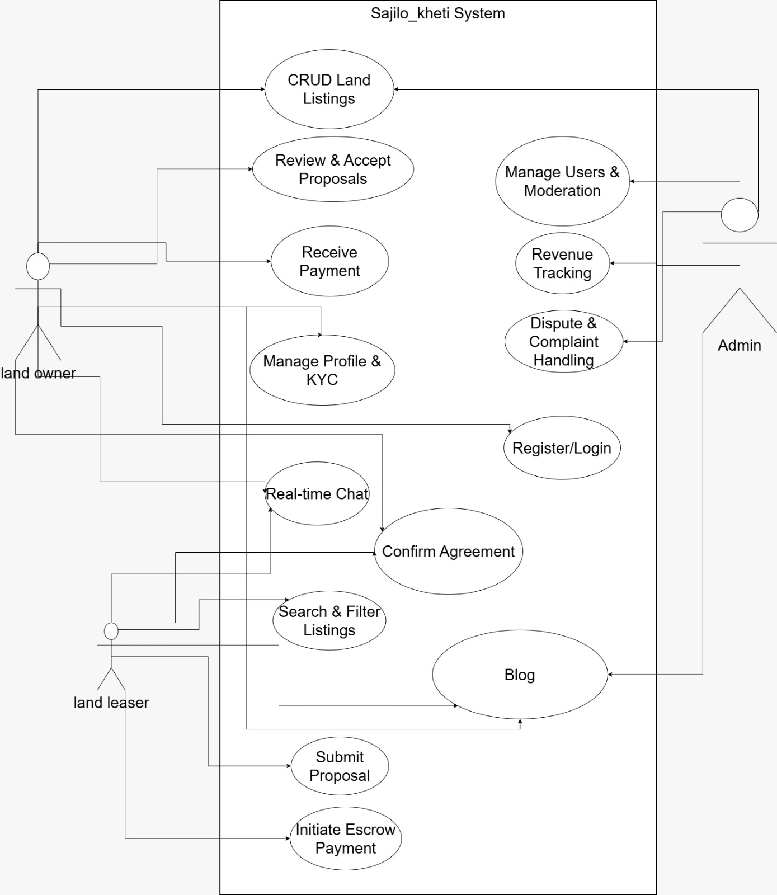<br>
  <em>Use cases for landowners, leasers and admins.</em>
</p>

### 6.4 Role flows

<table>
  <tr>
    <th align="center">Land Leaser</th>
    <th align="center">Land Owner</th>
    <th align="center">Admin</th>
  </tr>
  <tr>
    <td align="center" valign="top">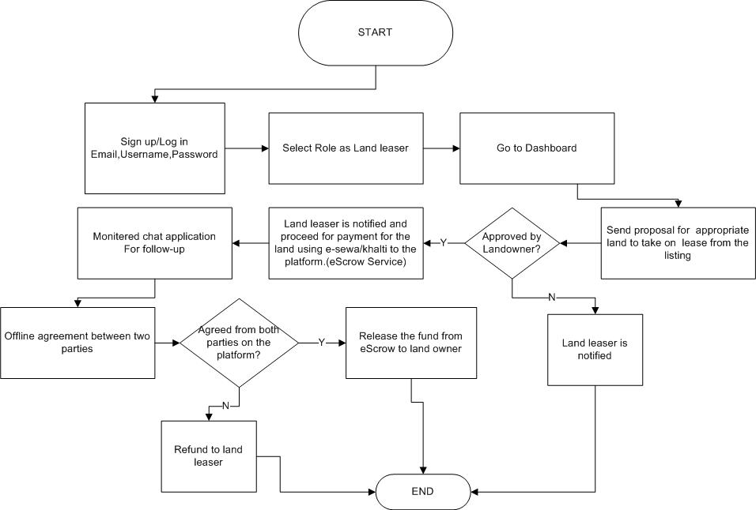</td>
    <td align="center" valign="top">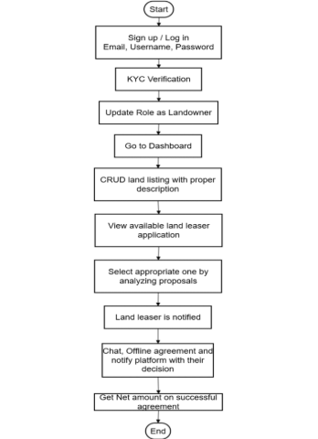</td>
    <td align="center" valign="top">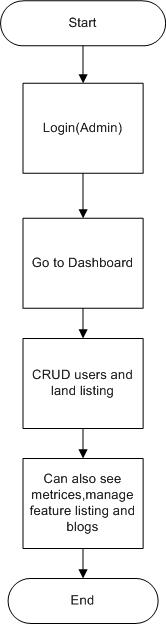</td>
  </tr>
</table>

**Leaser:** register → choose role → explore and filter listings → submit proposal → owner accepts → pay into escrow → chat and sign offline → escrow released (or refunded).

**Owner:** register → complete KYC → create and manage listings → review applications → select an applicant → chat and sign offline → receive payout after service charges.

**Admin:** log in → dashboard → manage users and listings (CRUD) → verify KYC and Malpot papers → track revenue → moderate blog content → handle complaints → view performance metrics.

---

## 7. Tech Stack

| Layer | Technology | Purpose |
|---|---|---|
| Framework | **Next.js 16** (App Router), **React 19** | Server rendering and client interactivity |
| Language | **TypeScript 5** | Type safety across the stack |
| Styling | **Tailwind CSS v4** | Utility-first responsive UI |
| Components | **shadcn/ui** + **Radix UI**, Lucide & Tabler icons | Accessible, reusable UI primitives |
| API layer | **tRPC 11** + **TanStack Query 5** | End-to-end typed communication with the backend |
| Forms & validation | **React Hook Form** + **Zod 4** | Schema-validated forms |
| Authentication | **Clerk** | Identity, sessions, role-based access |
| Backend *(separate repo)* | **Express.js** + tRPC | Business logic and API |
| ORM / DB *(backend)* | **Prisma** + **MongoDB** | Flexible document storage (varying land attributes) |
| File uploads | **UploadThing** | Land images, KYC and Malpot documents |
| Face detection | **face-api.js** (Tiny Face Detector) | Selfie validation during KYC |
| OCR | **Tesseract.js** | Extracting text from uploaded land/KYC documents |
| Real-time chat | **GetStream** (`stream-chat`, `stream-chat-react`) | Per-lease messaging |
| Maps | **Google Maps** (`@react-google-maps/api`) | Location display, directions, nearest Malpot office |
| Payments | **eSewa** (ePay v2, HMAC-SHA256 signed) | Escrow deposits |
| Blog CMS | **Sanity** (`sanity`, `next-sanity`) | Educational and community content |
| Email | **Resend** | Newsletter subscription and broadcasts |
| Analytics | **PostHog**, **Recharts** | Product analytics and dashboards |
| Notifications | Web Push (service worker + VAPID) | Browser notifications |
| Testing | **Vitest**, **React Testing Library**, **Playwright**, `@clerk/testing` | Unit, component and E2E tests |
| Tooling | **pnpm**, ESLint 9 | Package management and linting |

---

## 8. Project Structure

```
sajilo_kheti/
├── app/
│   ├── (auth)/                  # login, sign-up, forgot/reset password
│   ├── (shared-routes)/         # verify-agreement/[escrowId]
│   ├── actions/                 # server actions: newsletter subscribe, broadcast
│   ├── admin/                   # Admin console (users, lands, leases, KYC, studio, analytics, mail...)
│   ├── api/
│   │   ├── blog/                # comment, post, upload, upvote
│   │   ├── chat/token/          # GetStream user token
│   │   ├── esewa/               # initiate, callback, verify
│   │   └── uploadthing/         # file router (images, photo, citizenship, selfie, ...)
│   ├── blog/                    # list, [slug], new
│   ├── checkout/                # [applicationId], esewa-success, esewa-failure
│   ├── dashboard/               # Leaser dashboard
│   ├── landowner-dashboard/     # Owner dashboard
│   ├── navigate/[type]/[landId] # Directions to land / nearest Malpot office
│   ├── docs/  help/  report/  terms/  sso-callback/
│   ├── layout.tsx  page.tsx  globals.css
├── components/
│   ├── ui/                      # shadcn/ui primitives
│   ├── landing/                 # Hero, HowItWorks, Benefits, FAQ, Newsletter, ...
│   ├── auth/                    # RoleGate, BrandedLeftPanel
│   ├── application/             # ApplicationCard
│   ├── lands/                   # LandCard
│   ├── blog/                    # PostCard, CommentSection
│   ├── chat/                    # ChatProvider (GetStream)
│   ├── dashboard/  landowner/   # role sidebars
│   └── providers/               # PostHog, React Query
├── lib/                         # trpc client, eSewa utils, zod schemas, blog filter, push, uploadthing hooks
├── queryandmutation/            # React Query hooks wrapping tRPC calls
├── sanity/                      # Sanity client, image builder, queries, schemas (post, category, comment)
├── hooks/                       # shared React hooks
├── public/                      # service worker (sw.js), face-api models
├── e2e/                         # Playwright specs, fixtures, Clerk global setup
├── __tests__/                   # route-level tests (eSewa verify)
├── proxy.ts                     # Clerk middleware: protects /dashboard, /landowner-dashboard, /admin
├── sanity.config.ts             # Studio served at /admin/studio
├── next.config.ts  tailwind.config.ts  vitest.config.ts  playwright.config.ts
└── package.json
```

---

## 9. Routes & Access Control

Protected prefixes are enforced in two places: `proxy.ts` (Clerk middleware redirects unauthenticated visitors to `/login`) and the `RoleGate` component (redirects authenticated users with the wrong role to their own home).

| Role | Home route | Prefix |
|---|---|---|
| `LEASER` | `/dashboard` | `/dashboard/**` |
| `OWNER` | `/landowner-dashboard/dashboard` | `/landowner-dashboard/**` |
| `ADMIN` | `/admin` | `/admin/**` |

<details>
<summary><strong>Public & shared pages</strong></summary>

| Route | Description |
|---|---|
| `/` | Landing page |
| `/login`, `/sign-up`, `/forgot-password`, `/reset-password`, `/sso-callback` | Authentication |
| `/blog`, `/blog/[slug]`, `/blog/new` | Community blog |
| `/docs`, `/help`, `/terms`, `/report` | Documentation, support, terms, issue reporting |
| `/checkout/[applicationId]` | eSewa checkout for an accepted application |
| `/checkout/esewa-success`, `/checkout/esewa-failure` | eSewa redirect targets |
| `/navigate/[type]/[landId]` | Directions to the land or nearest Malpot office |
| `/verify-agreement/[escrowId]` | Shared agreement verification page |

</details>

<details>
<summary><strong>Leaser dashboard (<code>/dashboard</code>)</strong></summary>

| Route | Description |
|---|---|
| `/dashboard` | Overview (active leases, pending applications) |
| `/dashboard/find-land`, `/dashboard/lands`, `/dashboard/lands/[id]` | Explore and view listings |
| `/dashboard/lands/[id]/send-application` | Submit a lease proposal |
| `/dashboard/my-leases`, `/dashboard/my-lands` | Leases and accepted lands |
| `/dashboard/agreements`, `/dashboard/verify-agreement/[escrowId]` | Agreement handling and Malpot upload |
| `/dashboard/escrow` | Escrow payments |
| `/dashboard/verify-landowner` | KYC submission to become an Owner |

</details>

<details>
<summary><strong>Owner dashboard (<code>/landowner-dashboard</code>)</strong></summary>

| Route | Description |
|---|---|
| `/landowner-dashboard/dashboard` | Overview |
| `/landowner-dashboard/list-land` | Create a listing |
| `/landowner-dashboard/my-lands`, `/my-lands/[id]/applications` | Manage listings and their applications |
| `/landowner-dashboard/applications` | All incoming proposals |
| `/landowner-dashboard/escrow` | Escrows where the owner is the beneficiary |

</details>

<details>
<summary><strong>Admin console (<code>/admin</code>)</strong></summary>

| Sidebar item | Route |
|---|---|
| List Users | `/admin/users` |
| List Lands | `/admin/lands` |
| List Leases | `/admin/leases` |
| Review Landowner | `/admin/review-landowner` |
| Review Land Certificate | `/admin/review-certificate` |
| Transactions | `/admin/transactions` |
| Blogs (Sanity Studio) | `/admin/studio` |
| Reports | `/admin/reports` |
| Analytics | `/admin/analytics` |
| Send mail | `/admin/mail` |

The secondary sidebar (Settings, Get Help, Search) is currently a set of placeholders.

</details>

<details>
<summary><strong>Next.js route handlers (<code>app/api</code>)</strong></summary>

| Endpoint | Purpose |
|---|---|
| `GET /api/esewa/initiate` | Builds the signed eSewa form fields for an application |
| `POST /api/esewa/verify` | Verifies the eSewa HMAC signature, confirms the transaction belongs to the application, records the escrow deposit with the backend and creates the GetStream channel |
| `/api/esewa/callback` | eSewa callback handling |
| `GET /api/chat/token` | Issues a GetStream user token for the signed-in Clerk user |
| `/api/blog/post`, `/comment`, `/upvote`, `/upload` | Blog writes to Sanity (images go to the Sanity CDN) |
| `/api/uploadthing` | UploadThing file router (land images, profile photo, citizenship, selfie, ...) |

</details>

---

## 10. Backend API Reference

The frontend talks to the Express + tRPC backend through procedures grouped by domain.

### User management

| Procedure | Access | Description |
|---|---|---|
| `/users/create` | Public | Create or upsert a user with hydrated Clerk data |
| `/users/me` | Protected | Full profile of the current user |
| `/users/upgrade-request` | Protected | Submit KYC details to request the `OWNER` role |
| `/users/kyc-details` | Protected | Current user's KYC submission and status |
| `/users/all` | Admin | All users with identity-provider data |
| `/users/update-kyc-status` | Admin | Approve or reject KYC requests |
| `/users/all-kyc` | Admin | List KYC applications for review |

### Land management

| Procedure | Access | Description |
|---|---|---|
| `/land/publish` | Owner | Publish a new listing |
| `/land/search` | Public | Search by location and price filters |
| `/land/{landId}` | Public | Listing details |
| `/land/accept` | Admin | Approve a listing and make it public |
| `/land/reject` | Admin | Reject a listing |
| `/land/update-status` | Admin | Manually update a listing's status |
| `/land/admin/all` | Admin | All listings, with optional status filter |

### Lease management

| Procedure | Access | Description |
|---|---|---|
| `/lease/submit-application` | Leaser | Submit a proposal for a listing |
| `/lease/accept-application` | Owner | Accept a proposal and start the escrow phase |
| `/lease/reject-application` | Owner | Reject a proposal |
| `/lease/application/{id}` | Protected | Details of one application |
| `/lease/applications` | Protected | Applications relevant to the user |
| `/lease/my-accepted-apps` | Protected | Only accepted lease bids |

### Escrow & payments

| Procedure | Access | Description |
|---|---|---|
| `/lease/pay-escrow` | Leaser | Deposit lease funds into escrow |
| `/lease/verify-malpot` | Admin | Verify ownership papers and release funds to the owner |
| `/escrow/my-escrows` | Leaser | Active escrows started by the user |
| `/escrow/my-owner-escrows` | Owner | Escrows where the user is the beneficiary |
| `/escrow/{id}` | Protected | Transaction history and status |
| `/escrow/save-chat-channel` | Protected | Store the chat channel ID for an escrow |

---

## 11. Escrow & Payment Lifecycle

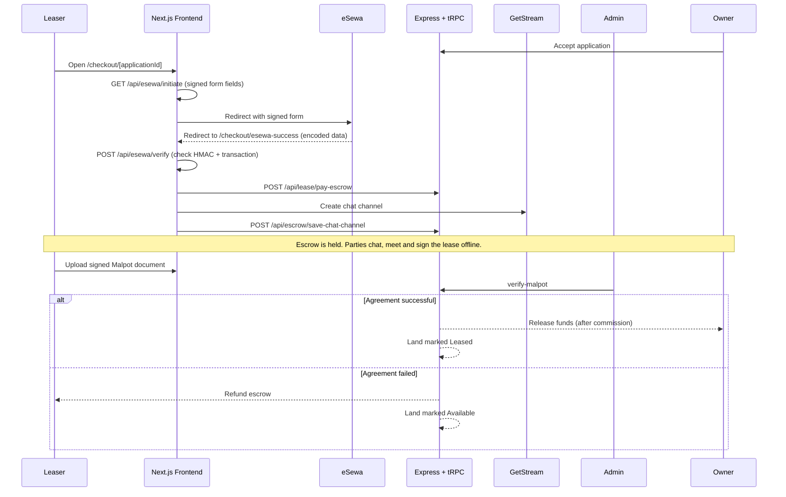
```mermaid
sequenceDiagram
    participant L as Leaser
    participant FE as Next.js Frontend
    participant ES as eSewa
    participant BE as Express + tRPC
    participant GS as GetStream
    participant A as Admin
    participant O as Owner

    O->>BE: Accept application
    L->>FE: Open /checkout/[applicationId]
    FE->>FE: GET /api/esewa/initiate (signed form fields)
    FE->>ES: Redirect with signed form
    ES-->>FE: Redirect to /checkout/esewa-success (encoded data)
    FE->>FE: POST /api/esewa/verify (check HMAC + transaction)
    FE->>BE: POST /api/lease/pay-escrow
    FE->>GS: Create chat channel
    FE->>BE: POST /api/escrow/save-chat-channel
    Note over L,O: Escrow is held. Parties chat, meet and sign the lease offline.
    L->>FE: Upload signed Malpot document
    A->>BE: verify-malpot
    alt Agreement successful
        BE-->>O: Release funds (after commission)
        BE-->>BE: Land marked Leased
    else Agreement failed
        BE-->>L: Refund escrow
        BE-->>BE: Land marked Available
    end
```

Notes on the implementation:

- The eSewa transaction UUID has the form `{applicationId}-{timestamp}`, so the application can be recovered on the success callback and checked against the request.
- The callback signature is verified using the `signed_field_names` that eSewa returns, in the order it provides them, and the `total_amount` string is hashed exactly as received.
- A platform commission is defined in `app/api/esewa/verify/route.ts` (`COMMISSION_RATE`).
- A **dev-only mock mode** (`NODE_ENV=development` and `mock: true`) skips the HMAC check so the flow can be exercised without the eSewa sandbox. It is disabled outside development.
- Escrow states move through **Holding → Released / Refunded**.

---

## 12. Getting Started

### Prerequisites

- **Node.js 20+** (the project uses Next.js 16 and React 19)
- **pnpm 10** (`packageManager` is pinned in `package.json`)
- The **backend** (`express-trpc`) cloned and running, listening on `http://localhost:8000` by default
- Accounts and keys for Clerk, UploadThing, GetStream, Sanity, Google Maps, eSewa (sandbox), Resend and PostHog (see below)

### Installation

```bash
git clone https://github.com/realsudarshan/sajilo_kheti.git
cd sajilo_kheti
pnpm install
```

> **Backend location matters.** `lib/trpc.ts` imports the backend's `AppRouter` **type** from `../../express-trpc/src/server/index`. Clone the backend as a sibling folder so the types resolve:
>
> ```
> workspace/
> ├── express-trpc/     # backend
> └── sajilo_kheti/     # this repo
> ```

### Configure the environment

Create a `.env.local` file in the project root (see [Environment Variables](#13-environment-variables)).

### Run in development

```bash
pnpm dev
```

The app runs at <http://localhost:3000>. Sanity Studio is available at <http://localhost:3000/admin/studio> for admin users.

### Build and run in production

```bash
pnpm build
pnpm start
```

### Available scripts

| Script | Description |
|---|---|
| `pnpm dev` | Start the Next.js dev server |
| `pnpm build` | Production build |
| `pnpm start` | Serve the production build |
| `pnpm lint` | Run ESLint |
| `pnpm test` | Run unit/component tests once (Vitest) |
| `pnpm test:watch` | Vitest in watch mode |
| `pnpm test:coverage` | Vitest with V8 coverage (text + HTML) |
| `pnpm test:e2e` | Run Playwright end-to-end tests |

---

## 13. Environment Variables

```env
# --- App & backend ---------------------------------------------------------
NEXT_PUBLIC_APP_URL=http://localhost:3000        # used for eSewa success/failure URLs
NEXT_PUBLIC_TRPC_URL=http://127.0.0.1:8000/trpc  # tRPC endpoint (default shown)
BACKEND_URL=http://localhost:8000                # used by server-side route handlers

# --- Clerk (auth) ----------------------------------------------------------
NEXT_PUBLIC_CLERK_PUBLISHABLE_KEY=
CLERK_SECRET_KEY=

# --- Maps ------------------------------------------------------------------
NEXT_PUBLIC_GOOGLE_MAPS_API_KEY=

# --- UploadThing -----------------------------------------------------------
UPLOADTHING_TOKEN=

# --- GetStream (chat) ------------------------------------------------------
NEXT_PUBLIC_STREAM_API_KEY=
STREAM_API_SECRET=

# --- Sanity (blog CMS) -----------------------------------------------------
NEXT_PUBLIC_SANITY_PROJECT_ID=
NEXT_PUBLIC_SANITY_DATASET=
SANITY_API_TOKEN=                                # server-side writes (posts, comments, image uploads)

# --- eSewa -----------------------------------------------------------------
NEXT_PUBLIC_ESEWA_MERCHANT_CODE=EPAYTEST         # sandbox default
NEXT_PUBLIC_ESEWA_BASE_URL=https://rc-epay.esewa.com.np
ESEWA_SECRET_KEY=                                # set your own secret outside the sandbox

# --- Email (Resend) --------------------------------------------------------
RESEND_API_KEY=

# --- Push notifications ----------------------------------------------------
NEXT_PUBLIC_VAPID_PUBLIC_KEY=

# --- PostHog analytics -----------------------------------------------------
NEXT_PUBLIC_POSTHOG_KEY=
NEXT_PUBLIC_POSTHOG_HOST=
POSTHOG_PROJECT_ID=                              # admin analytics page (server-side)
POSTHOG_PERSONAL_API_KEY=                        # admin analytics page (server-side)
```

> 🔒 Never commit `.env.local`. Variables prefixed with `NEXT_PUBLIC_` are exposed to the browser; keep secrets (`CLERK_SECRET_KEY`, `STREAM_API_SECRET`, `SANITY_API_TOKEN`, `ESEWA_SECRET_KEY`, `RESEND_API_KEY`, PostHog keys) server-side only.

---

## 14. Testing

The project uses **Vitest** with **React Testing Library** (jsdom) for unit, component and route tests, and **Playwright** (Chromium) for end-to-end tests.

```bash
pnpm test            # unit + component tests
pnpm test:coverage   # with coverage report
pnpm test:e2e        # Playwright (starts `pnpm dev` automatically)
```

| Level | Area | What is verified |
|---|---|---|
| Unit | Login schema (`lib/login-schema.test.ts`) | Validation rules and error messages |
| Unit | `LandCard` | Rendering of land details, pricing and fallback images |
| Unit | `ApplicationCard` | Accept/reject actions and dynamic status badges |
| Unit | `RoleGate` | Role-based redirects and loading/error states |
| Unit | Dashboard (`app/dashboard/dashboard.test.tsx`) | Role-specific data rendering and loading states |
| Integration | Blog filter (`lib/blog-filter.test.ts`) | Category and tag filtering logic |
| Route | eSewa verify (`__tests__/esewa-verify-route.test.ts`) | Signature and transaction checks in the verify handler |
| E2E smoke | `e2e/smoke.spec.ts` | Home, login and terms pages load |
| E2E system | `e2e/authenticated-flows.spec.ts` | Sign-up/login with role redirect, land browsing and filters, proposal submission to owner dashboard, lease acceptance unlocking chat |

The authenticated E2E suite is labelled **staging-only**: it relies on Clerk's testing tokens (`@clerk/testing`, configured in `e2e/global.setup.ts`) and a reachable backend, so run it against a staging environment with test credentials. Set `PLAYWRIGHT_BASE_URL` to target a deployed URL, or `PLAYWRIGHT_SKIP_WEBSERVER=1` to reuse a server you already started.

---

## 15. Limitations & Future Enhancements

**Current limitations**

- Tested mainly in a controlled development environment; it has not been run at large scale with many real users.
- The escrow flow runs against the **eSewa sandbox**. Real deployments need a verified financial service provider or payment gateway.
- KYC verification depends on **manual admin approval**, which will not scale with user growth.
- The `/admin/reports` sidebar entry and the secondary sidebar items (Settings, Get Help, Search) are not implemented yet.

**Planned improvements**

- Integrate production-grade payment gateways for real escrow.
- Automate KYC with document and face-matching checks (building on the existing OCR and face detection).
- Add advanced search and recommendations to surface suitable land faster.
- Deploy on scalable cloud infrastructure.
- Build a mobile application.

---

<div align="center">

**Sajilo Kheti**: helping idle land meet willing hands. 🌾

</div>
